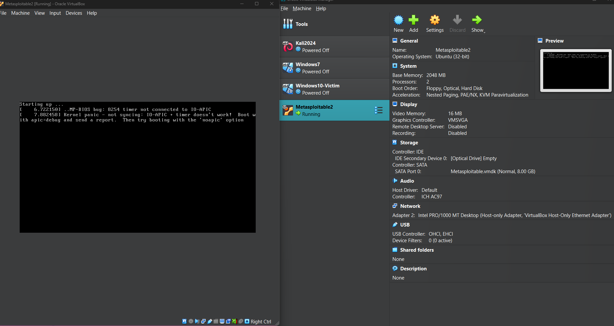
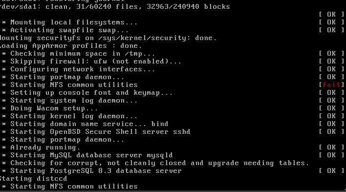
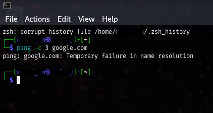

🛠️ Encountered a Kernel Panic – IO-APIC error when first launching Metasploitable2. Resolved by disabling IO APIC in VirtualBox settings and limiting CPU to 1 core.

---

⚠️ Metasploitable2 stalled at startup with repetitive service checks. No login screen appeared until hard restart. Possibly caused by failed NFS utilities or lingering kernel config issues.

---

🤦‍♀️ Tried running a simple ping test to verify connectivity—hit a "Temporary failure in name resolution" wall instead. Turns out, Kali with no DNS is not ideal for much of anything.

