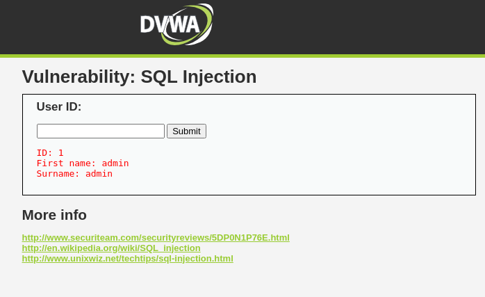
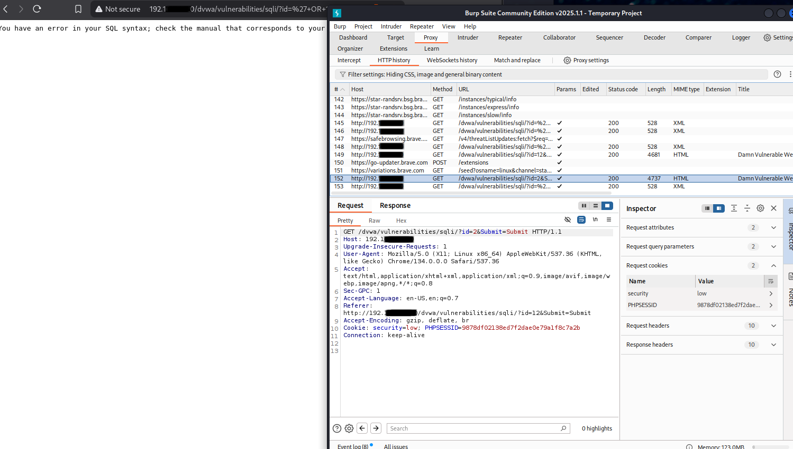
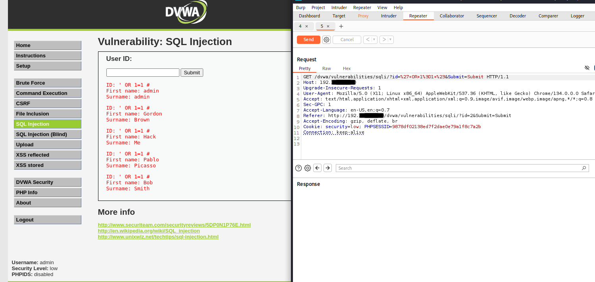

for future screenshots.

## First attempt at SQL injection using Burp Suite

**🔹 What I Was Doing:**
I wanted to test the DVWA SQL injection module when it's set to 'low' security. I started off using a safe `id=1` query to establish a known-good baseline (username: admin/password: admin). Then I tried putting `' OR 1=1--` into the field expecting it to return all users in the DB.

**🔸What Went Wrong:**
Instead of a very validating dump of fake users on my screen, I got a SQL error because, for some strange reason, it did not appreciate my syntax. Turns out DVWA's parser didn't like the double dash `--` without whitespace or proper closing. After much research, I learned that I cannot assume all payloads will work the same across environments.

**💡What I Learned:**

- SQLi is PICKY. I have a feeling as I progress in my Pen Testing Education, I'll learn that SQL in general is picky. The payload `' OR 1=1 #` worked while `' OR 1=1--` did not. A welcome reminder that one of the best things you can do as you gain more experience is to add as many subtle variations to your repertoire --- whitespace matters, comment styles matter, and context is everything.

---

#### Result after testing user ID # 1

#### Result after testing user ID # `' OR 1=1--`

#### Result after testing user ID # `' OR 1=1 #`

