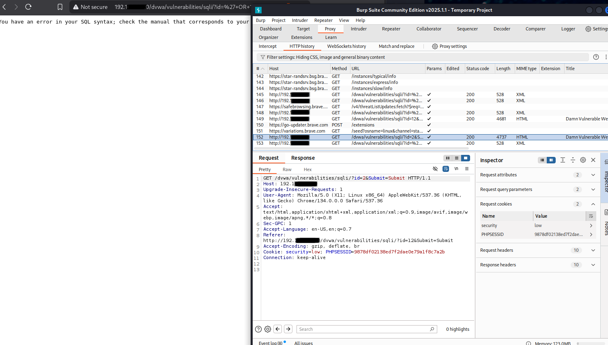
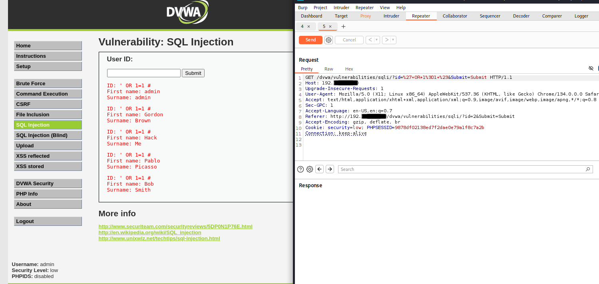
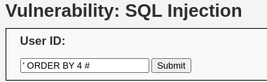
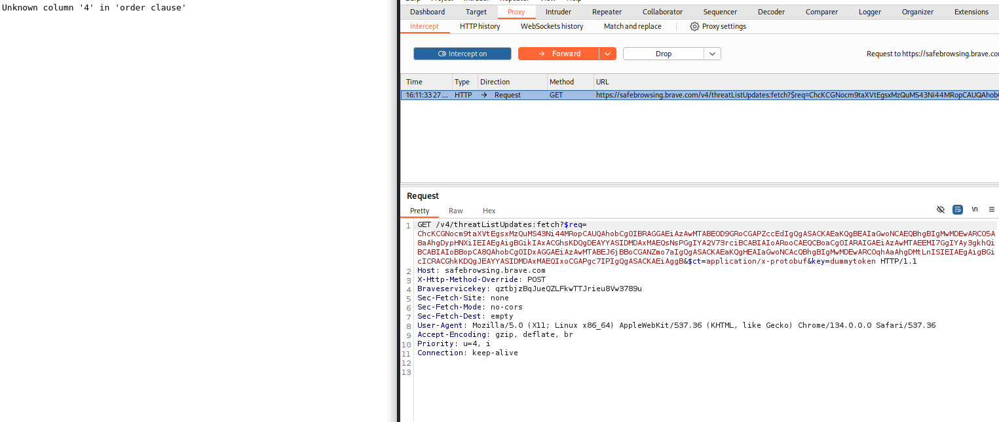
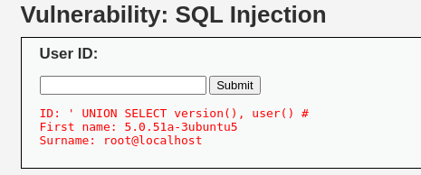

## First attempt at SQL injection using Burp Suite

**🔹 What I Was Doing:**
I wanted to test the DVWA SQL injection module when it's set to 'low' security. I started off using a safe `id=1` query to establish a known-good baseline (username: admin/password: admin). Then I tried putting `' OR 1=1--` into the field expecting it to return all users in the DB.

**🔸What Went Wrong:**
Instead of a very validating dump of fake users on my screen, I got a SQL error because, for some strange reason, it did not appreciate my syntax. Turns out DVWA's parser didn't like the double dash `--` without whitespace or proper closing. After much research, I learned that I cannot assume all payloads will work the same across environments.

**💡What I Learned:**

- SQLi is PICKY. I have a feeling as I progress in my Pen Testing Education, I'll learn that SQL in general is picky. The payload `' OR 1=1 #` worked while `' OR 1=1--` did not. A welcome reminder that one of the best things you can do as you gain more experience is to add as many subtle variations to your repertoire --- whitespace matters, comment styles matter, and context is everything.

---

#### Result after testing user ID # 1

#### Result after testing user ID # `' OR 1=1--`

#### Result after testing user ID # `' OR 1=1 #`

---

## First attempt at accessing a SQL schema/table using Burp Suite

**🔹 What I Was Doing:**  
I wanted to see how many columns were in the SQL table the backend of this site uses to organize its users. The goal was to get the columns and craft a valid SQL injection with `UNION SELECT`

**🔸What Went Wrong:**  
I tried to find the number of columns by starting at 1 column and iterating up from there. Research told me that when I don't get an error anymore, that's probably the number of columns in the table. Being new to SQL and all the new words and phrases it requires, I didn't understand what it meant when the page returned the following error:
`"Unknown column '5' in 'order clause' or "Unknown column '6' in 'order clause'"` and so on. I thought there were 4+ columns, not less than 4. I went too far.

**💡What I Learned:**  
If you hit an error at `ORDER BY 3`, that means column 3 doesn’t exist. The number of columns is one less than the failing number. So if 3 fails and 2 works, you’ve got 2 columns. Easy math.

---

#### Searching for number of columns using SQL in the form field:

#### Error I was getting for every column number I tried:

#### Finally got some info back when I used 2 as the magic column number:

---
