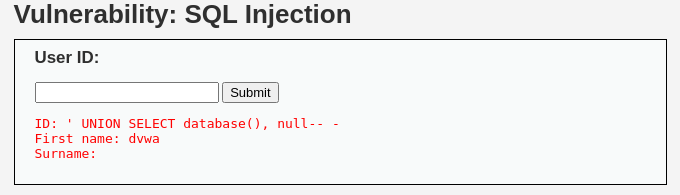

# 🛠️ Day #6 – The Hunt for the Real Host (Screenshot Edition)

## Screenshot Explanations

### Screenshot 1: Database Name Enumeration

#### 🔹 #1 What I Was Doing 🔹

I was testing a simple SQL injection to confirm the active database name with `' UNION SELECT database(), null-- -`

#### 💡 #1 What I Learned 💡

The active database behind is page is named `dvwa`. That's the default for Damn Vulnerable Web App -- so it let me know everything is working as expected and I'm clear for some deeper digging.

---
