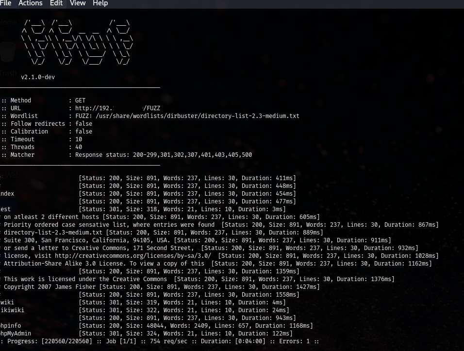
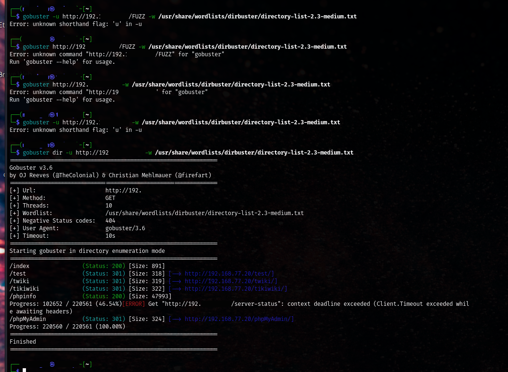
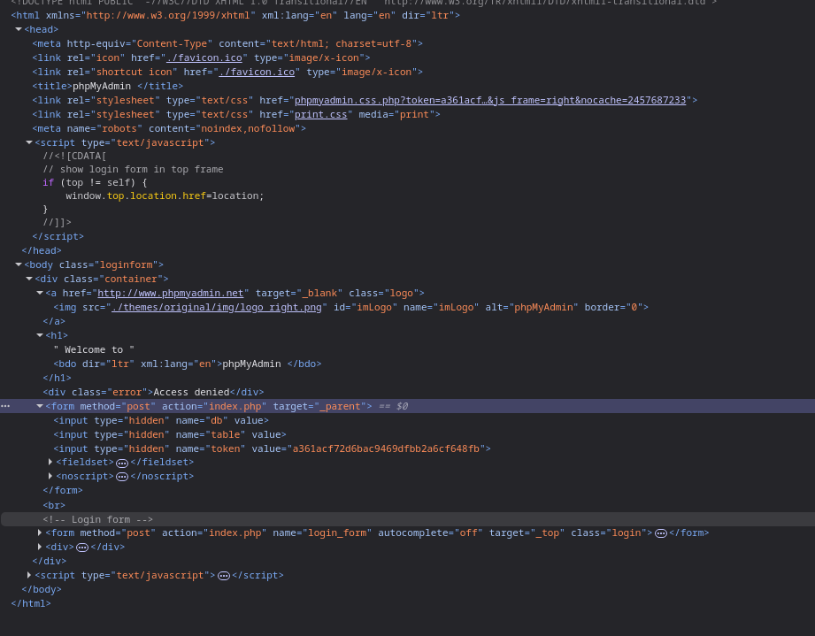

# 🛠️ Day #7 – Discovery & Web Recon Basics (Screenshot Edition)

## Screenshot Explanations

### Block 1: Intro to FFUF

> The command I used: `ffuf -u http://-TargetIPAddress-/FUZZ -w /usr/share/wordlists/dirbuster/directory-list-2.3-medium.txt` told FFUF to take each word in the wordlist and replace "FUZZ" in the given URL with that word. If the server gave a valid response in return, that meant the resource/endpoint probably exists!

> I wanted to compare `gobuster` to `ffuf`, so I ran the same wordlist against the DVWA IP. It took a few tries to get the syntax right, but eventually I kicked off the scan and got some familiar results.

> After discovering `/phpMyAdmin/` via Gobuster, I opened the URL in the browser to check it out. I landed on a login form, tried a few "gimme" username/password combos (none worked), and decided to use the `inspect` option to read through the HTML.

> I looked all over for hints: form actions, hidden fields, CSRF tokens. I found a field named `token` with a value that might be valuable later on to prevent form replay or automate brute force attempts.

> This page dumps all PHP settings and environment variables. It told me I'm working with PHP 5.2.4-2ubuntu5.10, which is ancient and almost guaranteed to be vulnerable.

#### 💡#1 What I Learned 💡

- Gobuster is fast and focused
- Wondering if directories like `/phpMyAdmin/` and `/phpinfo/` are possible wins.
- Not everything "hidden" is secure, nor is it necessarily something to exploit.
- Version info gives you multiple exploit paths -- especially for known vulnerable setups, like DVWA.
  
---

### Block 2: Digging Deeper with FFUF and Gobuster

Screenshot 1: test-endpoint-results.png
Caption: Navigated to `http://192.168.77.20/test/` after discovering it during directory fuzzing. The Apache web server returned a file listing, confirming that directory indexing is enabled on this path.

Screenshot 2: testoutput-endpoint.png
Caption: Opening `/test/testoutput/` reveals a lone file called `ESAPI_logging_file_test`. Maybe from a logging or debugging process?

Screenshot 3: testoutput-devtools.png
Caption: Using devtools to inspect the blank file confirms that the request was successful. The file exists, but no front end or other useful information is there.

#### 💡#1 What I Learned 💡