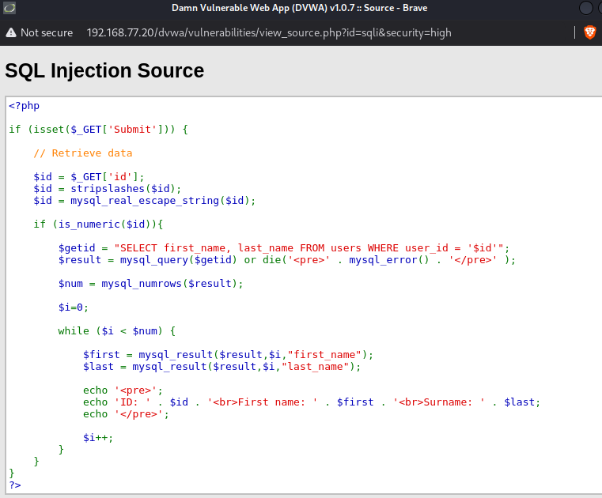
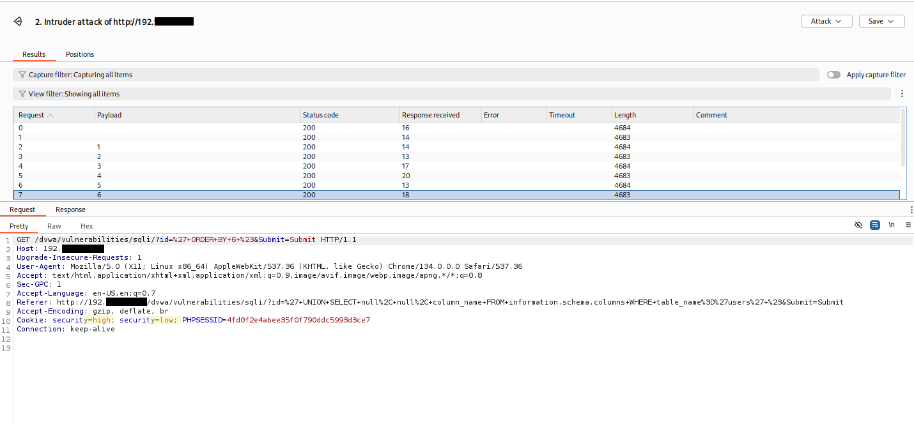
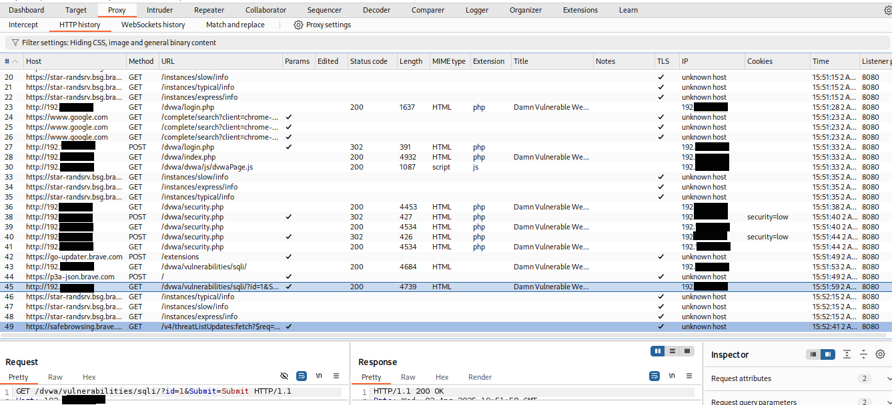
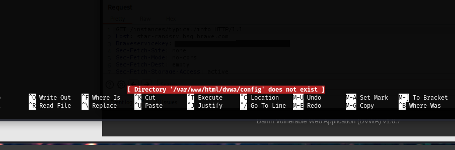
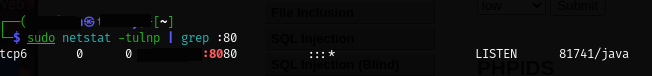

# Screenshots for Day 5: Break More Things
## Screenshot 1

**🔹 What I Was Doing 🔹**

> While exploring DVWA's SQL injection module, I noticed a "View Source" button on the lower right-hand side of the page. I clicked it out of curiosity -- just poking around -- and landed on a PHP file showing the backend logic for how the application handles SQL queries. I wanted to understand how DVWA is processing the input I'm feeding it. 

**🔸 What Went Wrong 🔸**

> Technically, nothing! This was a key moment though because seeing this source code raised some questions -- namely, if the app is escaping input with `mysql_real_escape_string()` and checking for numeric values, why was I still able to exploit SQL injection (SQLi) earlier? That question led to the realization that DVWA's security level was changing every time I switched from the home page to anywhere else. 

**💡 What I Learned 💡**

- DVWA letting me see the PHP source code helped me better understand how input are filtered and what logic sets up the checkpoint for injection.
- The application is using `is_numeric()` to limit input types and `my_sql_real_escape_string()` to sanitize them -- basic defenses when DVWA's security level is set to 'low', but defenses that get stronger as the level increases.  
- Reading source code isn't cheating! It's intel! Real-world apps won't give me this luxury on a silver, in-your-face-button platter all the time, but when they do, it can give me a big advantage.

---

## Screenshot 2

**🔹 What I Was Doing 🔹**

> I wanted to test the Burp Suite Intruder Tab for the first time, using it to automate the discovery of how many columns the `users` table in DVWA actually returns. I was hoping it would help prep for a working `UNION SELECT` payload. I knew from earlier, manual attempts, that setting up each number by hand would get tedious fast, so Intruder felt like the right tool for the loop. 

**🔸 What Went Wrong 🔸**

> Even though I was running a successful attack cycle -- no errors in the requests themselves -- I noticed the lengths of responses stayed nearly identical across payloads. That's when I spotted something strange in the request cookie: `security=low` and `security=high` were both included. This confirmed a sneaky suspicion that *something* wasn't right with the DVWA security level's persistence. It was quietly switching back to `high` between pages/requests. Even though I'd asked it nicely, many, MANY times to stay on `low`. 

**💡 What I Learned 💡**

- Intruder is a fun tool! Even though the results didn't tell me exactly what I wanted, they told me something wasn't right. 
- Cookie inspection in Burp can catch config drift, like a security level quietly flipping.
- Always validate your test environment's integrity before assuming you're the problem. I mean, I guess *technically* since I'm the one who set up the lab, I *am* the problem, but it's been a long one, so today we're blaming the environment. 
---

## Screenshots 3-7

 and MySQL(3306), and unknown services on ports like 8180. Does this mean DVWA is technically accessible, but I just don't get to see which service is actually hosting it?")

**🔹 What I Was Doing 🔹**

> After noticing that the DVWA security setting kept reverting to `high` no matter how often I reset it to `low`, I tried to trace the true location of the DVWA web server. My goal was to identify where DVWA was actually hosted, validate its configuration, and figure out why its behavior wasn't aligning with my expectations.
> I started with Burp Suite's proxy tab, clicking on different buttons on DVWA and getting proof that the security level was changing. Then I looked for the file manually and couldn't find it. I then looked for the directory using Nano (because who doesn't need more practice with that?). Nothin. Finally I did a netstat search as well as an nmap scan (again, practice = good), but none of those told me where I might find what I was looking for. 

**🔸 What Went Wrong 🔸**

> I fell face-first into an environment rabbit hole. My nmap scan confirmed Metasploitable2 was alive and listening on port 80, but nothing there showed DVWA. My netstat output showed something running on 127.0.0.1:8080 (*cough* Burp Suite *cough*), but not much else. Directory lookups failed. In Burp, the cookie values gave me mixed signals. The `Host` and cookie paths seemed inconsistent, leading me to question whether or not I was barking up the wrong VM entirely. 
> Did I break something? Or just imagine this WHOLE lab into existence? 

**💡 What I Learned 💡**

- Sometimes environments fib. Not out of malice, at least I don't *think* it's out of malice. Sometimes there are legacy setups, misconfigurations, or just weird VirtualBox behaviors.
- Validating my own assumptions was a good move, even though it was/is painful. I *assumed* my Burp traffic was fully aligned with DVWA's backend. I *assumed* DVWA was running on the Metasploitable2 machine I set up. All of that needed to be verified. 
- If I could get the last 2+ workdays back, I think I'd try running `ps aux | grep apache` or another similar process to check inside each of my VMs for hosted web services and paths. Flashy fuzzing attemps could have waited. 
